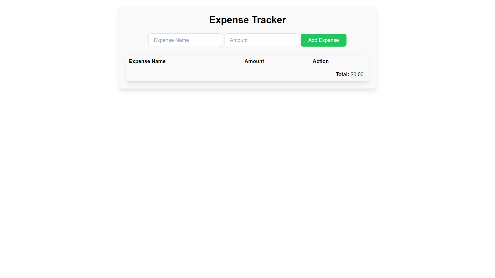
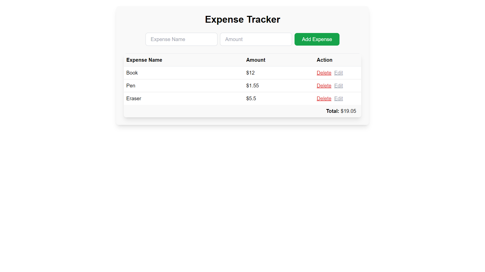
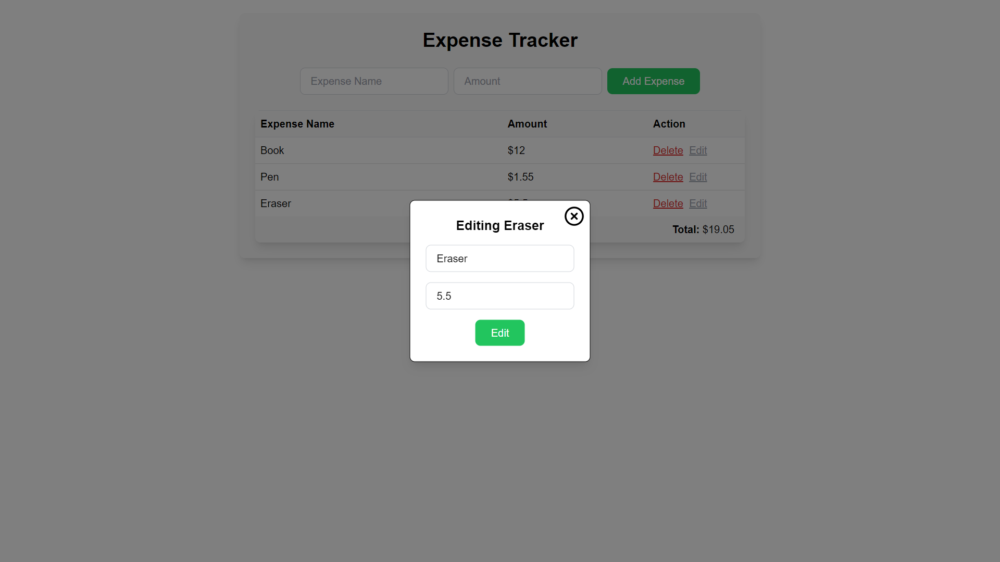
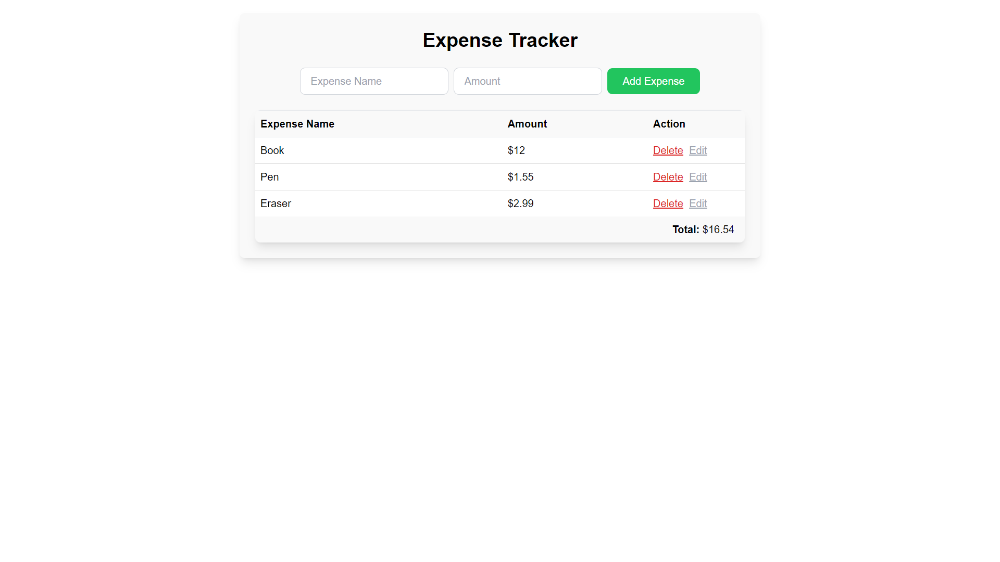

# Expense Tracker App Using Tailwind

## How to run:

- Project Setup

```
    npm install
```

- Compiles and hot-reloads for development

```
    npm run dev
```

- Open with Live Server Extension in VSCode

## App UI

1. Home page
   

2. After adding some items
   

3. Edit page
   

4. After edited item
   
